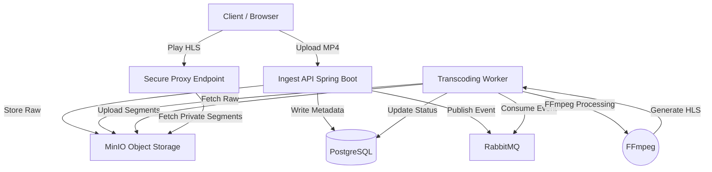

# 🎥 ViDUp - Distributed Video Streaming Platform


A production-grade, distributed video engineering platform featuring **chunked upload**, **asynchronous transcoding**, **adaptive bitrate streaming (HLS)**, and **secure content delivery**. Built to demonstrate advanced backend patterns similar to Netflix/YouTube architectures.

---

## 🏗️ System Architecture

The platform uses a decoupled, event-driven architecture to handle heavy media processing without blocking user requests.

### High-Level Design
1. **Ingest Layer:** Spring Boot REST API handles multipart uploads and stores raw video in MinIO.
2. **Event Queue:** RabbitMQ decouples video ingestion from processing for horizontal scalability.
3. **Processing Layer:** Dedicated worker services consume queue events and run FFmpeg transcoding jobs.
4. **Delivery Layer:** Secure proxy endpoint serves HLS segments with authentication and access control.



### Core Components

* **Ingest Service:** Spring Boot REST API handling multipart uploads and metadata.
* **Processing Worker:** Dedicated service for asynchronous FFmpeg transcoding.
* **Storage:** MinIO (S3-compatible) for storing raw video and HLS chunks (.m3u8/.ts).
* **Database:** PostgreSQL for user data, video metadata, and processing state.
* **Queue:** RabbitMQ for decoupling ingestion from processing.
* **RTMP Server:** Nginx-RTMP for live streaming ingestion from OBS/broadcast tools.

---

## ⚡ Performance & Scalability

The system is designed to handle thousands of concurrent uploads and streams through horizontal scaling and asynchronous processing.

### 🎯 Distributed Processing

* **Non-Blocking Uploads:** API immediately returns success after storing raw video, offloading transcoding to workers.
* **Horizontal Scaling:** Multiple worker instances can consume from the queue simultaneously for parallel processing.
* **Backpressure Management:** Queue-based architecture prevents system overload during traffic spikes.
* **Resource Isolation:** CPU-intensive transcoding runs in separate processes, keeping API responsive.

### 📊 Streaming Performance

* **Adaptive Bitrate (HLS):** Videos transcoded into multiple quality levels for adaptive streaming.
* **Chunked Delivery:** Small .ts segments (2-10s) enable faster startup and smooth playback.
* **CDN-Ready:** HLS segments can be cached by CDN edge servers for global distribution.
* **Bandwidth Optimization:** Clients automatically switch quality based on network conditions.

---

## 🛠️ Key Features

### 1. 🚀 Video Ingestion

* **Chunked Upload:** Large files uploaded in manageable chunks to prevent timeout and support resume.
* **Format Support:** Accepts MP4, MOV, AVI, MKV, and other FFmpeg-compatible formats.
* **Metadata Extraction:** Automatically extracts video duration, resolution, codec, and bitrate.
* **Storage Redundancy:** MinIO supports distributed object replication for data durability.

### 2. 🎬 Transcoding Pipeline

* **Asynchronous Processing:** FFmpeg jobs run in background workers without blocking upload requests.
* **HLS Generation:** Converts videos to HTTP Live Streaming format with .m3u8 playlist and .ts segments.
* **Multi-Quality Encoding:** Generates 360p, 480p, 720p, 1080p variants (configurable).
* **Progress Tracking:** Real-time status updates (pending → processing → completed → failed).

### 3. 🔐 Secure Content Delivery

* **Private Buckets:** All video files stored in private MinIO buckets, not publicly accessible.
* **Streaming Proxy:** Spring Boot proxy validates user auth before serving HLS segments.
* **Signed URLs:** Time-limited access tokens prevent unauthorized video access.
* **DRM Foundation:** Architecture ready for integration with Widevine/FairPlay DRM systems.

### 4. 📡 Live Streaming

* **RTMP Ingestion:** Nginx-RTMP server accepts live streams from OBS, Streamlabs, or broadcast tools.
* **Real-Time HLS:** Converts RTMP to HLS on-the-fly for browser playback.
* **Low Latency:** Optimized for sub-5-second latency from ingest to playback.
* **Recording:** Optionally archives live streams as VOD content.

---

## 🔧 Tech Stack

* **Language:** Java 17+
* **Framework:** Spring Boot 3.0+
* **Database:** PostgreSQL 14+
* **Message Queue:** RabbitMQ 3.11+
* **Object Storage:** MinIO (S3-compatible)
* **Video Processing:** FFmpeg 5.0+
* **Live Streaming:** Nginx-RTMP
* **Containerization:** Docker + Docker Compose
* **Build Tool:** Maven

---

## 🏃‍♂️ Quick Start (Local Development)

### Prerequisites

* Docker Desktop
* Java 17 or higher
* Maven 3.8+
* FFmpeg (optional, used if available locally)

### 1. Start Infrastructure

Spin up the database, queue, storage, and streaming server:

```bash
docker-compose up -d
```

This starts:
- PostgreSQL on port 5432
- RabbitMQ on port 5672 (management UI: 15672)
- MinIO on port 9000 (console: 9001)
- Nginx-RTMP on port 1935

### 2. Run the Backend

Start the Spring Boot application:

```bash
cd backend
mvn spring-boot:run
```

The API will start on `http://localhost:8081`

### 3. Access the Platform

* **Upload Interface:** `http://localhost:8081`
* **Video Player:** `http://localhost:8081/player.html`
* **MinIO Console:** `http://localhost:9001` (User: `minio_admin` / Pass: `minio_password`)
* **RabbitMQ Console:** `http://localhost:15672` (User: `guest` / Pass: `guest`)

### 4. Test Live Streaming

Configure OBS with these settings:
- **Server:** `rtmp://localhost:1935/live`
- **Stream Key:** `test_stream`
- **Playback URL:** `http://localhost:8080/live/test_stream.m3u8`

---

## 🐳 Production Deployment

The backend uses a multi-stage Docker build with FFmpeg pre-installed on Alpine Linux.

### Build the Image

```bash
docker build -t vidup-backend ./backend
```

### Run Container

```bash
docker run -p 8081:8081 \
  -e SPRING_DATASOURCE_URL=jdbc:postgresql://host.docker.internal:5432/stream_db \
  -e RABBITMQ_HOST=host.docker.internal \
  -e MINIO_ENDPOINT=http://host.docker.internal:9000 \
  vidup-backend
```

### Docker Compose Production

```bash
docker-compose -f docker-compose.prod.yml up -d
```

---

## 🔍 Engineering Challenges Solved

### 1. Distributed Transcoding

Instead of blocking the HTTP upload request, the system offloads processing to a queue. This allows the API to handle thousands of uploads while workers process videos at their own pace.

**Benefits:**
- API remains responsive during heavy processing
- Workers can be scaled independently based on queue depth
- Failed jobs can be retried without affecting user experience
- Resource-intensive FFmpeg operations isolated from web server

### 2. HLS (HTTP Live Streaming)

Raw MP4 files are transcoded into HLS playlists, enabling:

* **Adaptive Bitrate:** Clients automatically switch quality based on bandwidth
* **Faster Playback:** Player downloads small chunks rather than entire file
* **Seek Performance:** Jump to any timestamp without downloading previous content
* **CDN Compatibility:** Small segments cache efficiently at edge locations

### 3. Secure Content Delivery (Signed Proxy)

Direct S3/MinIO links are not exposed to the public:

* Bucket is **Private** - no public read access
* Spring Boot acts as **Streaming Proxy**
* Users request `/api/videos/{id}/segment.ts`
* Backend authenticates user, fetches chunk securely, streams response
* Ready for integration with JWT/OAuth authentication

### 4. Live Streaming Ingest

Nginx-RTMP container listens on port 1935:

* **Ingest:** Accepts `rtmp://localhost:1935/live` from OBS/broadcast software
* **Output:** Converts to HLS on-the-fly for browser playback
* **Recording:** Archives live streams as VOD content automatically
* **Multi-Quality:** Transcodes live streams to multiple bitrates in real-time

---

## 📡 API Endpoints

### Video Management

| Method | Endpoint | Description |
|:---|:---|:---|
| `POST` | `/api/videos/upload` | Upload video file (multipart form) |
| `GET` | `/api/videos` | List all videos with metadata |
| `GET` | `/api/videos/{id}` | Get video details and status |
| `DELETE` | `/api/videos/{id}` | Delete video and all segments |

### Streaming

| Method | Endpoint | Description |
|:---|:---|:---|
| `GET` | `/api/videos/{id}/stream.m3u8` | Get HLS master playlist |
| `GET` | `/api/videos/{id}/segment/{filename}` | Securely fetch .ts segment |
| `GET` | `/api/live/{stream_key}.m3u8` | Access live stream playlist |

### Example Upload Request

```bash
curl -X POST "http://localhost:8081/api/videos/upload" \
  -H "Content-Type: multipart/form-data" \
  -F "file=@video.mp4" \
  -F "title=My Video" \
  -F "description=Sample upload"
```

---

## 🚀 Future Scope & Improvements

* **Multi-Quality Encoding:** Implement full ABR ladder with 360p, 480p, 720p, 1080p, 4K variants.
* **DRM Integration:** Add Widevine/FairPlay support for premium content protection.
* **Thumbnail Generation:** Auto-generate video thumbnails at multiple timestamps using FFmpeg.
* **Subtitle Support:** Upload and serve WebVTT/SRT subtitle tracks alongside video.
* **Analytics Dashboard:** Track views, watch time, geographic distribution, and quality metrics.
* **Resume Uploads:** Implement tus protocol for resumable uploads of large files.
* **Webhook Notifications:** Send callbacks when transcoding completes or fails.
* **AI-Powered Features:** Content moderation, automatic tagging, scene detection using ML models.
