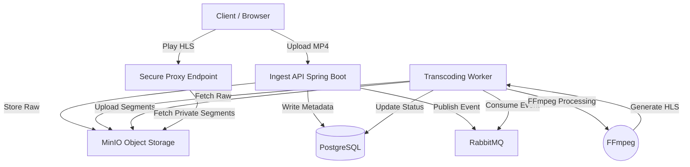

# ViDUp - Distributed Video Streaming Platform

A scalable, distributed video engineering platform featuring chunked upload, asynchronous transcoding, adaptive bitrate streaming (HLS), and secure content delivery. Built to demonstrate advanced backend patterns similar to Netflix/YouTube architectures.

## 🏗 Architecture

The system uses a decoupled, event-driven architecture to handle heavy media processing.


### Core Components

- **Ingest Service**: Spring Boot REST API handling multipart uploads and metadata.
- **Processing Worker**: Dedicated service for asynchronous FFmpeg transcoding.
- **Storage**: MinIO (S3-compatible) for storing raw video and HLS chunks (.m3u8/.ts).
- **Database**: PostgreSQL for user data, video metadata, and processing state.
- **Queue**: RabbitMQ for decoupling ingestion from processing.

## 🚀 Quick Start (Local Development)

### Prerequisites

- Docker Desktop
- Java 17 or higher
- Maven

### 1. Start Infrastructure

Spin up the database, queue, storage, and streaming server.
```bash
docker-compose up -d
```

### 2. Run the Backend

Start the Spring Boot application (uses your local Java & FFmpeg if available, or falls back to configuration).
```bash
cd backend
mvn spring-boot:run
```

### 3. Access the Platform

- **Upload Interface**: http://localhost:8081
- **Video Player**: http://localhost:8081/player.html
- **MinIO Console**: http://localhost:9001 (User: `minio_admin` / Pass: `minio_password`)
- **RabbitMQ Console**: http://localhost:15672 (User: `guest` / Pass: `guest`)

## 🛠 Engineering Challenges Solved

### 1. Distributed Transcoding

Instead of blocking the HTTP upload request, the system offloads processing to a queue. This allows the API to handle thousands of uploads while workers process videos at their own pace (Backpressure management).

### 2. HLS (HTTP Live Streaming)

Raw MP4 files are transcoded into HLS playlists. This enables:

- **Adaptive Bitrate**: (Foundation laid for multi-quality streams).
- **Faster Playback**: The player downloads small chunks rather than the huge file.

### 3. Secure Content Delivery (Signed Proxy)

Direct S3/MinIO links are not exposed to the public.

- The bucket is **Private**.
- The Spring Boot backend acts as a **Streaming Proxy**.
- Users request `/api/videos/{id}/segment.ts`.
- The backend authenticates the user (logic ready), fetches the chunk securely, and streams it back.

### 4. Live Streaming Ingest

Includes an Nginx-RTMP container listening on port 1935.

- **Ingest**: Accepts `rtmp://localhost:1935/live` from OBS.
- **Output**: Converts to HLS on the fly for browser playback.

## 🐳 Production Deployment

The backend is fully containerized. The Dockerfile uses a multi-stage build and installs a distinct FFmpeg layer on Alpine Linux, removing dependencies on the host OS.

### Build the Image
```bash
docker build -t stream-engine-backend ./backend
```

### Run Container
```bash
docker run -p 8081:8081 \
  -e SPRING_DATASOURCE_URL=jdbc:postgresql://host.docker.internal:5432/stream_db_dev \
  stream-engine-backend
```